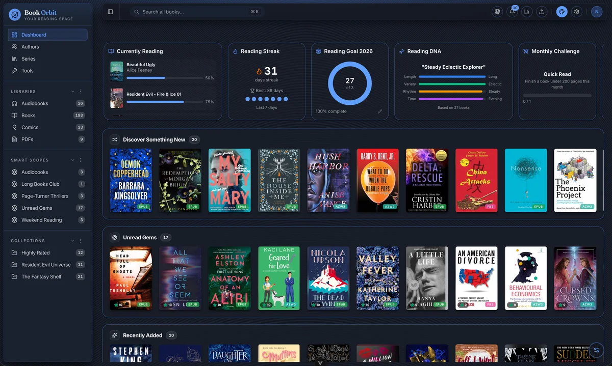

# BookOrbit documentation

<p align="center">
  
</p>

<p align="center">
  The documentation and product site for
  <a href="https://github.com/bookorbit/bookorbit">BookOrbit</a>, a self-hosted
  library and reading platform for ebooks, audiobooks, comics, and PDFs.
</p>

<p align="center">
  <a href="https://github.com/bookorbit/bookorbit-site/actions/workflows/docker-publish.yml"></a>
  <a href="https://github.com/bookorbit/bookorbit-site/pulls"></a>
</p>

<p align="center">
  <a href="https://bookorbit.app">Website</a> ·
  <a href="https://bookorbit.app/what-is-bookorbit">Documentation</a> ·
  <a href="https://github.com/bookorbit/bookorbit">Application repository</a>
</p>



This repository contains the public-facing BookOrbit landing page and the full
user documentation. It does not contain the BookOrbit application itself. For
the server, web app, releases, and installation artifacts, visit the
[main BookOrbit repository](https://github.com/bookorbit/bookorbit).

## What is here

- A responsive product landing page built with Astro and Vue
- Task-focused documentation powered by Astro Starlight
- Guides for installation, library management, reading, administration, and integrations
- Optimized product screenshots with click-to-zoom support
- A production Docker image served by unprivileged Nginx
- Link validation, type checking, and full-text search generated at build time

## Run locally

You need [Node.js 22](https://nodejs.org/) and npm. If you use `nvm`, run
`nvm use` from the repository root to select the version in `.nvmrc`.

```bash
git clone https://github.com/bookorbit/bookorbit-site.git
cd bookorbit-site
npm ci
npm run dev
```

Open <http://localhost:5174>. Changes to pages, styles, and documentation are
reflected automatically while the development server is running.

## Commands

| Command | Purpose |
| --- | --- |
| `npm run dev` | Start the local development server on port 5174 |
| `npm run check` | Run Astro and TypeScript diagnostics |
| `npm run build` | Build the production site and validate internal links |
| `npm run preview` | Preview the production build locally |
| `npm run images:optimize` | Convert new or changed source screenshots to WebP |
| `npm run images:optimize:force` | Rebuild every screenshot from its source image |

## Repository layout

```text
bookorbit-site/
├── public/images/           Optimized screenshots committed to Git
├── scripts/                 Documentation asset tooling
├── src/
│   ├── assets/              Shared brand assets
│   ├── components/          Vue components for the landing page
│   ├── content/docs/        User documentation in Markdown
│   ├── pages/               Astro routes
│   └── styles/              Starlight theme and content styles
├── astro.config.mjs         Site metadata, plugins, and sidebar navigation
├── Dockerfile               Production documentation image
└── package.json             Scripts and dependencies
```

## Writing documentation

Each guide is a Markdown file in [`src/content/docs`](src/content/docs). Add a
concise title and description in frontmatter, begin with the outcome the reader
will achieve, and organize the rest around real tasks. Use root-relative links
for other guides, such as `[Installation](/installation)`.

Screenshots are maintained separately from their optimized output:

1. Place a PNG or JPEG in `public/images/_originals/<section>/`.
2. Give it a descriptive kebab-case filename.
3. Run `npm run images:optimize`.
4. Reference the generated WebP file from the guide.

The originals directory is intentionally ignored by Git. Only the optimized
WebP output is committed. See [CONTRIBUTING.md](CONTRIBUTING.md) for the complete
content, screenshot, validation, and pull request workflow.

## Build the container

The production image builds the static site and serves it on port `8080` using
unprivileged Nginx.

```bash
docker build -t bookorbit-site .
docker run --rm -p 8080:8080 bookorbit-site
```

Then open <http://localhost:8080>.

## Contributing

Documentation fixes and improvements are welcome. Read
[CONTRIBUTING.md](CONTRIBUTING.md), run `npm run check` and `npm run build`, then
open a pull request with a focused description of the reader-facing change.

For application bugs and feature requests, use the
[main BookOrbit issue tracker](https://github.com/bookorbit/bookorbit/issues).
