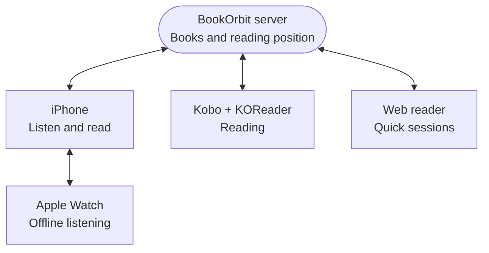

Hi. I build BookOrbit, and I also use it every day. People often ask what a real setup looks like once all the sync options are turned on, so this page is mine, end to end.

This is one opinionated workflow, not the recommended one. BookOrbit does not require any of it. If you keep separate EPUBs and audiobooks and never touch an e-reader, everything below still works, you just use fewer parts of it.

## My setup

| Where | What I do there |
|-------|-----------------|
| **iPhone** | Most of my listening. The BookOrbit iOS app plays the narration straight out of the book file. |
| **Apple Watch** | Walks and runs. The narration is downloaded to the Watch, so I leave the phone at home. |
| **Kobo running KOReader** | Proper reading sessions, with the [BookOrbit KOReader plugin](/koreader-plugin) installed. |
| **Laptop** | The BookOrbit [web reader](/reader), for a quick chapter when the Kobo is not with me. |
| **Server** | Self-hosted BookOrbit. It is the hub. Every device is a spoke. |

Nothing syncs device to device. Each client talks only to my server, which keeps the newest reading position and hands it to whichever client asks next.

## One file per book

I used to keep two files for every book: a plain EPUB to read, and a single M4B to listen to. Two files, two positions, and a small daily tax of remembering how far along I was in the other one.

BookOrbit has always read EPUB3. What it did not have until **v3.0.0** was read-along: an EPUB3 whose narration audio is mapped to the text by a media overlay, so listening and reading are the same position in the same file. Once that landed, I rebuilt most of my library with [Storyteller](/storyteller-read-aloud), which takes an EPUB and an audiobook and produces one read-along EPUB3.

So my books now hold three files:

| File | Why it is still there |
|------|----------------------|
| **Read-along EPUB3** | My primary file. Text, narration, and timing in one place. Everything below runs on this. |
| **Original EPUB** | Kept as an untouched text-only edition. Not required for anything I do. |
| **Original M4B** | Kept as insurance, and it is not dead weight: with matching audio on the same book, the standalone audiobook player can exchange positions with the EPUB3 through the [read-aloud progress sync bridge](/storyteller-read-aloud#optional-add-a-standalone-audiobook). |

If you are starting fresh, the read-along EPUB3 alone is enough. I keep the other two because re-deriving them later is more work than storing them now.

:::note[Check the Primary badge]
When a book holds several files, the one marked **Primary** is the default file and the one Kobo Sync delivers. A library scan normally picks the read-along EPUB when EPUB is your highest-priority format, but it is worth confirming on the book's Files tab.
:::

BookOrbit identifies a read-along book by what is inside it, not by its name. The EPUB needs a real media overlay and its synchronized audio. An EPUB3 that merely contains an audio file does not qualify.

## A day with one book

Here is the actual loop, in the order it usually happens.

### 1. Listen on the iPhone

I open the book in the iOS app and use **Listen**, or **Read Along** when I want the text to follow along. The app plays the narration from inside the EPUB3. No separate audiobook is involved.

Say I get 10% in. That position goes to the server as a reading position, not as an audio timestamp, because the media overlay maps the narration back to a sentence in the text.

### 2. Take it to the Apple Watch

Before a run, I use the Watch transfer control beside the read-along EPUB in the app. BookOrbit packages the narration audio from that EPUB for the Watch. No standalone audiobook is needed.

Out on the run the Watch plays on its own, with the phone at home. When it reconnects, the position it reached comes back and the server takes it.

:::note[The transfer needs a connection, the playback does not]
The phone starts the transfer and the Watch pulls the narration from the server, so both need network at that moment. Once the files land, playback is fully offline and independent of the phone. The Watch plays narration as audio; it does not show the EPUB text.
:::

### 3. Switch to the Kobo

Later I want to actually read. I open the BookOrbit catalog inside KOReader and download the book to the device.

The read-along EPUB3 is large, because it carries the narration. I do not want that on an e-reader, and I do not have to move it: when the KOReader plugin downloads an EPUB with a media overlay, it asks the server for an audio-free copy, and BookOrbit rebuilds one on the fly. The original file in my library is never modified.

The rebuilt copy keeps the text, the spine, and the sentence anchors Storyteller left behind. It drops the audio and the media overlay. That is what makes the position from step 1 still mean something on the device.

Then I sync in KOReader, and it moves to where the narration left off.

### 4. Read, then push back

I read for a while. On close, auto sync uploads the position, highlights, status, rating, and reading time. I can also run **Sync this book now** from the plugin menu if I want it out immediately.

### 5. Back to the iPhone

Next time I open the book on the phone, listening resumes from where I stopped reading on the Kobo. Same position, arriving from the other direction.

That is the whole point of the single file. There is no "audiobook progress" and "ebook progress" to reconcile, because there is one book and one position.

## What to expect at the edges

I would rather set the expectation than have you think something is broken.

**Coming back to KOReader is chapter-accurate, not line-accurate.** When the newest position came from the phone or the web reader, BookOrbit hands KOReader the chapter that position falls in. When the newest position came from KOReader itself, it restores exactly. In practice, opening at the top of the right chapter after an hour of listening is fine; just do not expect the cursor on the exact sentence in that direction. The reverse direction, KOReader to phone, is precise.

**Re-downloading does not confuse KOReader.** The audio-free rebuild is byte-identical every time, so the device fingerprints it as the same document on every download and sync keeps working.

**"Audio-free" does not mean "tiny".** The output size depends on the book's images and other resources. It will be much smaller than the read-along file, but BookOrbit does not promise a particular number.

**KOReader never silently gets the big file.** If the rebuild fails, BookOrbit reports an error rather than transferring a book full of narration. [Kobo Sync](/kobo) behaves differently: it falls back to the original read-along EPUB, which can be very large.

**Read-aloud progress sync says Unavailable on single-file books.** That status belongs to the optional bridge between a read-along EPUB and a separate standalone audiobook. If a book only has the EPUB3, there is nothing to bridge, and Read Along still works normally.

## If you want to copy this setup

1. Build or obtain a read-along EPUB3 per book. Storyteller is what I use.
2. Put it in the book's library folder and scan. Confirm the file is identified as a **Read-along EPUB**, and that it is **Primary** if the book has several files.
3. Install the [KOReader plugin](/koreader-plugin) from **Settings > KOReader**. It arrives preconfigured with your server URL and credentials.
4. Install the iOS app and sign in to your server. The app requires BookOrbit v3.0.0 or later.
5. Download a book in the app once while connected, so the narration is cached for offline listening.

For manual transfers without the plugin, the web app's download menu has a **KOReader EPUB** option labelled **no audio**, which builds the same kind of copy.

## Related pages

- [Storyteller Read-Aloud Books](/storyteller-read-aloud) - what the file contains and how every client uses it
- [KOReader Plugin](/koreader-plugin) - install, catalog, and sync controls
- [KOReader Sync](/koreader) - what is exchanged, and three-way sync with Kobo
- [Kobo Sync](/kobo) - if you read on the Kobo's own reader instead of KOReader
- [Annotations & Highlights](/annotations) - where highlights from every source land
