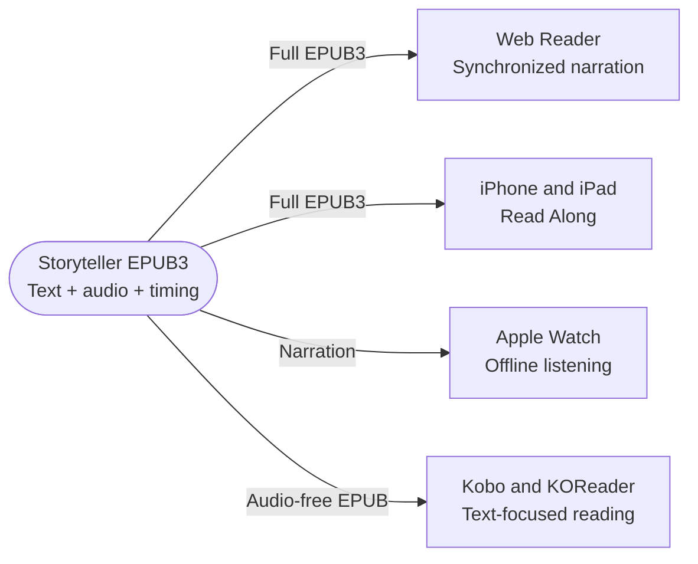
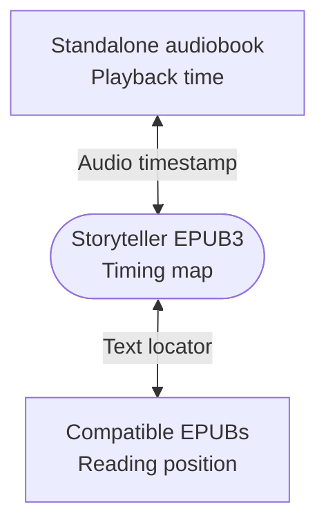

A Storyteller EPUB3 is a complete read-aloud book. It contains the book text, the narration audio, and an EPUB media overlay that maps the narration to the text.

You only need the Storyteller EPUB to use Read Along in BookOrbit. A separate audiobook and a plain EPUB are optional.

:::note[One file is enough]
Add the Storyteller `.epub`, scan the library, and open that file to read or listen. You do not need to extract its audio or add another copy of the book.
:::

## What the Storyteller EPUB contains

BookOrbit recognizes a read-along book by its capabilities, not its filename. The EPUB must contain a usable media overlay, normally a SMIL timing map, together with its synchronized audio resources. An ordinary EPUB3 with unrelated embedded audio is not enough.

During a library scan, BookOrbit inspects EPUB files for that media overlay. When EPUB is the highest-priority available format, BookOrbit prefers the read-along EPUB over other EPUB files as the book's primary file.

Making the Storyteller EPUB primary is recommended when a book has several files. The primary file controls the default reading file and the file delivered to Kobo. Read Along itself can still open a non-primary read-along EPUB when you choose that file explicitly.

## Add a Storyteller book

1. Put the Storyteller `.epub` in the book's library folder.
2. Scan the library.
3. Open the book and check that the EPUB is identified as a **Read-along EPUB** in its file information.
4. Open the EPUB and start listening.

If the book has several formats, also confirm that the Storyteller EPUB has the **Primary** badge when you want it to be the default file and the source used for Kobo delivery.

## Read and listen

### Web Reader

The Web Reader plays the narration embedded inside the Storyteller EPUB. While it plays, the current narrated sentence is highlighted.

The read-along controls support:

- Play, pause, previous sentence, and next sentence
- Playback speeds from 0.5x to 4.0x
- A sleep timer
- Spacebar play and pause, arrow-key sentence navigation, and `+` or `-` speed changes
- Browser media controls on supported browsers and devices

To begin from the visible page, use the reader's listening control. To begin from a particular sentence, select text in that sentence and choose **Read from here** from the selection menu.

BookOrbit stores the current media-overlay fragment and can return to that narrated sentence when the EPUB is opened again.

### BookOrbit for iPhone and iPad

The iOS app also reads the narration directly from the Storyteller EPUB. Use **Read Along** to open the reader with narration, or use **Listen** and choose **EPUB Narration** when both embedded narration and a separate audiobook are available.

For offline Read Along, download the Storyteller EPUB in the app while connected so the document and its media-overlay playlist are cached.

### Apple Watch

The iOS app can also send the narration from a read-along EPUB to Apple Watch. In the book's file list, use the Watch transfer control beside the read-along EPUB. BookOrbit packages the EPUB's narration resources for offline audio playback on the Watch; no standalone audiobook is required.

Apple Watch plays the narration as an audiobook-style experience. It does not display the EPUB text or sentence highlighting on the Watch screen.

## Kobo and KOReader

Storyteller EPUBs can be very large because they carry the narration audio. BookOrbit can create a temporary audio-free EPUB for text-focused e-reader delivery. The original Storyteller file in the library is not changed.

The rebuilt copy removes the embedded narration and media-overlay playback resources while retaining the text anchors used to translate reading positions. Its final size depends on the source book, images, and other resources, so BookOrbit does not promise a particular output size.

### Kobo

Kobo Sync delivers the book's primary file. When the primary file is a read-along EPUB, BookOrbit tries to remove its narration before applying the normal Kobo delivery settings:

- If KEPUB conversion is enabled and the audio-free file is within the configured conversion limit, BookOrbit sends a KEPUB.
- Otherwise, BookOrbit sends the audio-free EPUB.
- A converted audio-free KEPUB may be reused from the conversion cache on later downloads.

Enable **Two-way progress sync** in [Kobo settings](/kobo) and use the BookOrbit-delivered KEPUB when you want precise positions to return from Kobo.

:::caution[Kobo fallback]
If BookOrbit cannot safely build the audio-free copy, Kobo delivery falls back to the original Storyteller EPUB. That fallback can be much larger because it still contains narration.
:::

### KOReader

The [BookOrbit KOReader plugin](/koreader-plugin) requests an audio-free copy whenever it downloads an EPUB with a media overlay. If a plain EPUB and a read-along EPUB would use the same device filename, the read-along copy receives a ` - Read Along.epub` suffix so the files do not overwrite each other.

You can also open the download menu in the BookOrbit web app and choose **KOReader EPUB** with the **no audio** label. This builds the same kind of temporary copy for a manual transfer.

KOReader delivery does not fall back to the full Storyteller EPUB. If the audio-free copy cannot be generated, BookOrbit reports an error instead of unexpectedly transferring the embedded audio.

## Optional: add a standalone audiobook

A separate audiobook is not needed for embedded narration. Add one only when you also want to use the ordinary standalone audiobook player and carry your position between that player and the Storyteller EPUB.

BookOrbit supports standalone audio in `.m4b`, `.mp3`, `.m4a`, `.opus`, `.ogg`, and `.flac` files. A multi-file audiobook must be attached to the same BookOrbit book in the correct track order.

After you add matching standalone audio, open the book's **Details** tab and find **Read-aloud progress sync**. This setting describes the bridge between two audio timelines:

BookOrbit translates real positions through the Storyteller timing map. It does not copy a percentage between files.

It does not determine whether the Storyteller EPUB can play its own narration.

### Bridge requirements

The bridge becomes **Enabled** when BookOrbit finds:

- An EPUB with a usable media overlay
- One or more standalone audio files on the same book
- Complete duration metadata for both narrations
- Durations close enough to represent the same recording

The maximum permitted duration difference is the smaller of 5 percent or five minutes. This rejects likely mismatches such as abridged recordings, missing or duplicate tracks, bonus audio, and incorrectly ordered tracks.

When the bridge is enabled, BookOrbit uses the Storyteller timing map to translate between the standalone audio timeline and a text location. The source timestamp accompanies each update so an older report does not replace a newer one.

:::tip[Unavailable can be expected]
If your book contains only the Storyteller EPUB, **Read-aloud progress sync** reports **Unavailable** because there is no separate audiobook to bridge. Read Along in the Web Reader and iOS app still works normally.
:::

### Bridge status messages

| Status or message | Meaning | What to do |
| :--- | :--- | :--- |
| **Enabled** | The standalone audiobook and media-overlay EPUB can exchange positions. | Nothing. |
| **Disabled** | You turned off cross-format position translation for your account. | Enable it if both files contain the same narration. |
| **A read-along EPUB with media overlays is required.** | No usable media-overlay EPUB was detected. | Check the EPUB and rescan the library. |
| **Matching standalone audiobook files are required.** | The book has no separate audio files. | Ignore this for an EPUB-only setup, or add the matching audiobook if you want the optional bridge. |
| **Audio duration metadata is incomplete.** | BookOrbit could not measure every required audio timeline. | Check the files and refresh their metadata. |
| **Durations do not match closely enough.** | The two narrations exceed the duration tolerance. | Check the edition, track order, missing tracks, duplicates, and bonus audio. |

The setting is per user. Disabling it does not remove files or erase stored progress. It only stops BookOrbit from translating new positions between the standalone audiobook and EPUB files for that account.

## Optional: add a plain EPUB

You may also keep the untouched source EPUB on the same book when you want a smaller or unmodified text-only edition. It is not required for Read Along or e-reader delivery.

When the standalone-audiobook bridge is enabled, BookOrbit can also try to translate the current location into sibling EPUB files. Storyteller usually adds sentence identifiers that the plain EPUB does not contain, so BookOrbit compares the corresponding chapter text and converts the location only when it can establish a compatible match. It skips incompatible chapters or editions instead of guessing.

Highlights, notes, and bookmarks are not copied between separate EPUB files by this bridge. They continue to follow the normal [annotation sync](/annotations) rules for the file on which they were created.

## Troubleshooting

### Read Along is not offered

- Confirm that you added the Storyteller output EPUB, not only the original source EPUB.
- Confirm that the EPUB contains a valid media overlay and synchronized audio resources.
- Rescan the library after replacing or adding the file.
- Check the book's file information for the **Read-along EPUB** indicator.

### The wrong file opens or reaches Kobo

Check the **Primary** badge. When EPUB is the preferred format, a library scan normally chooses the media-overlay EPUB over a plain EPUB. A different higher-priority format can still remain primary.

### Read Along works but progress sync says Unavailable

This is normal when there is no separate standalone audiobook. The status belongs to the optional cross-format bridge, not embedded EPUB narration.

### An e-reader download is unexpectedly large

For a manual download, choose the explicitly labeled **KOReader EPUB** option with **no audio**. For Kobo, confirm that the Storyteller EPUB is primary and check the server logs for an audio-free rebuild failure, because Kobo falls back to the original EPUB when rebuilding fails.

## Quick reference

| Goal | Files required |
| :--- | :--- |
| Read and listen together in the Web Reader | Storyteller EPUB only |
| Read Along or listen to EPUB narration on iPhone or iPad | Storyteller EPUB only |
| Listen to the EPUB narration on Apple Watch | Storyteller EPUB only |
| Send an audio-free copy to Kobo or KOReader | Storyteller EPUB only |
| Synchronize with a separate audiobook player | Storyteller EPUB plus matching standalone audio |
| Keep an additional untouched text edition | Storyteller EPUB plus optional plain EPUB |
